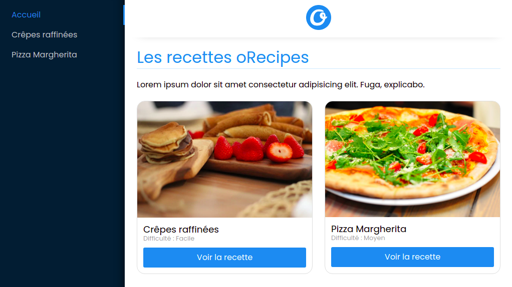

# Challenge oRecipes

Ce projet est un challenge que j'ai effectué pendant ma [formation O'Clock](https://oclock.io/formations/developpeur-web-fullstack-javascript), durant le mois de spécialisation React.\
Il s'agissait de créer une application web qui affiche des recettes, avec **React** et **Express**.



## Technologies

- React.js
- Javascript
- React router dom
- Sass
- Redux
- Jest
- Express.js

## Installation

```
git clone https://github.com/Nina-petit/Formation-oRecipes.git
cd Formation-oRecipes
npm install
npm start
```
Lancer le serveur:
```
cd app
npm install
node server.js
``````